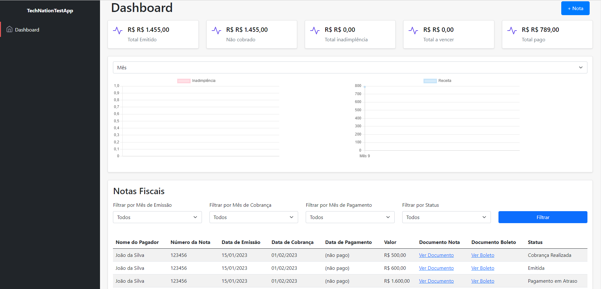

# TechNation - Fullstack Teste Técnico

## Desenvolvedor

- **Nome:** Marcos Paulo
# TechNation Teste Técnico - Fullstack

## Desenvolvedor
**Nome:** Marcos Paulo  
**Localização:** Brasília, DF

## Versão da Aplicação
**Versão:** 1.0.0

## Tecnologias Utilizadas
- **Framework:** .NET 8
- **Banco de Dados:** SQL Server Express
- **Frontend:** jQuery 3.7.1, Bootstrap 5.1.0
- **Docker:** Sim

## Instruções para Execução

### Pré-Requisitos
Certifique-se de que você tenha os seguintes softwares instalados:
- [Docker](https://docs.docker.com/get-docker/)
- [SQL Server Express](https://www.microsoft.com/en-us/sql-server/sql-server-downloads)
- [Visual Studio](https://visualstudio.microsoft.com/) (ou outra IDE que suporte .NET 8)

### Configuração do Banco de Dados

1. **Instale o SQL Server Express:**
   Siga as instruções no [site oficial](https://www.microsoft.com/en-us/sql-server/sql-server-downloads) para baixar e instalar o SQL Server Express.

2. **Configure a String de Conexão:**
   Abra o arquivo `appsettings.json` e localize a seção `ConnectionStrings`. Ajuste os parâmetros de conexão de acordo com o seu ambiente. Exemplo:

   ```json
   {
     "ConnectionStrings": {
       "DefaultConnection": "Server=localhost;Database=TechNationDB;Trusted_Connection=True;"
     }
   }

### 3. Configuração do Docker

Certifique-se de que o Docker esteja instalado e em execução em sua máquina. Em seguida, você pode configurar e executar o contêiner Docker usando o `Dockerfile` incluído no projeto.

#### Dockerfile

Este projeto inclui um `Dockerfile` para construir a imagem do contêiner. Para construir e executar o contêiner, siga os passos abaixo:

1. **Construir a Imagem Docker**

docker build -t [nome container].

#### Banco de dados

dotnet ef migrations add InitialCreate
dotnet ef database update

#### Backup e codigo do banco de dados

Está localizado na pasta raiz do projeto com o nome "TechNationDB.bak"

## Imagem do Projeto


